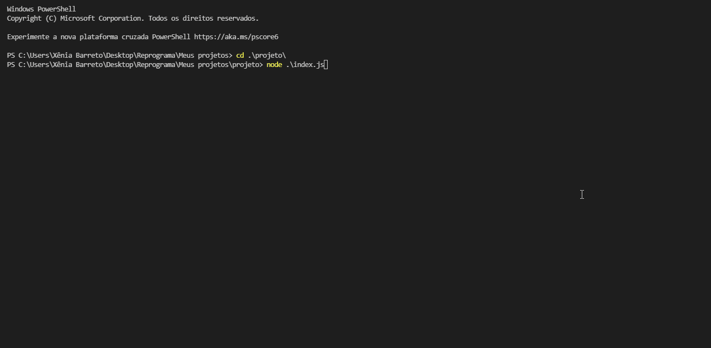

</h1>
<h2 align="center">
  
by Xênia Barreto 

</h2>

# Projeto Java Script e Node.js

---

## Projeto: Sistema de Livros

A proposta foi utilizar nossos conhecimentos em Javascript e Node.js para criar um projeto já pensando em algo real, algo que utilizamos muito no nosso dia a dia: **um sistema que armazena informações de livros**. 

No arquivo database.js criei e exportei a base no formato **Array de Objetos** contendo alguns livros e desenvolvi uma lógica que permite os comportamentos abaixo:
  - buscar livros pela categoria; 
  - buscar livros recomendados para leitura;
  - buscar livros que já li;
  - buscar livros que não li e estão na minha lista de desejos;
  - buscar livros por ordenação de pagina de forma crescente e em ordem alfabética, caso usuário(a) não escolha a prmeira opção. 

 
### Exemplo de implementação

### Como sugestão ao projeto foi aderido as seguintes práticas: 

- Uso de sintaxe ES6.
- Nome das variáveis em inglês.
- Inserir 'commit' do código a cada etapa concluída.

##  Me conheça melhor! 
  Onde vocês me encontram:
  - [Linkedin](https://www.linkedin.com/in/x%C3%AAnia-barreto-020334209/)
  - [Instagram](https://www.instagram.com/xeniabarreto/)
  - E-mail: xeniabarreto22@gmail.com
  - Fone/WhatsApp: 55 11 98018-1235